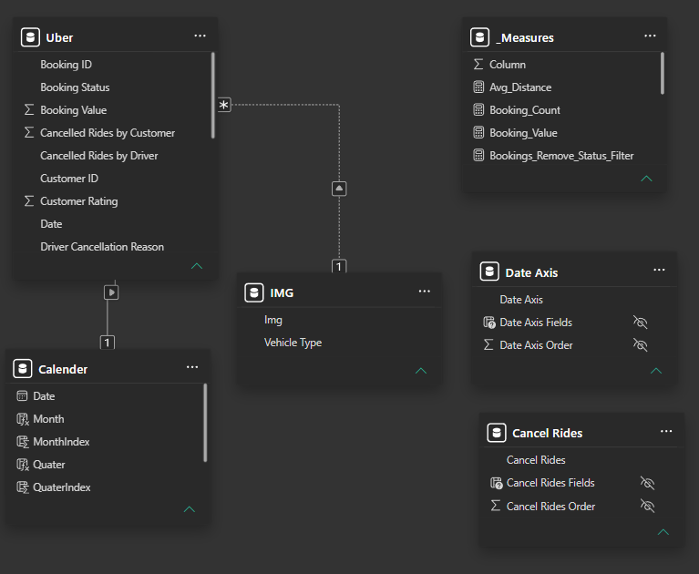
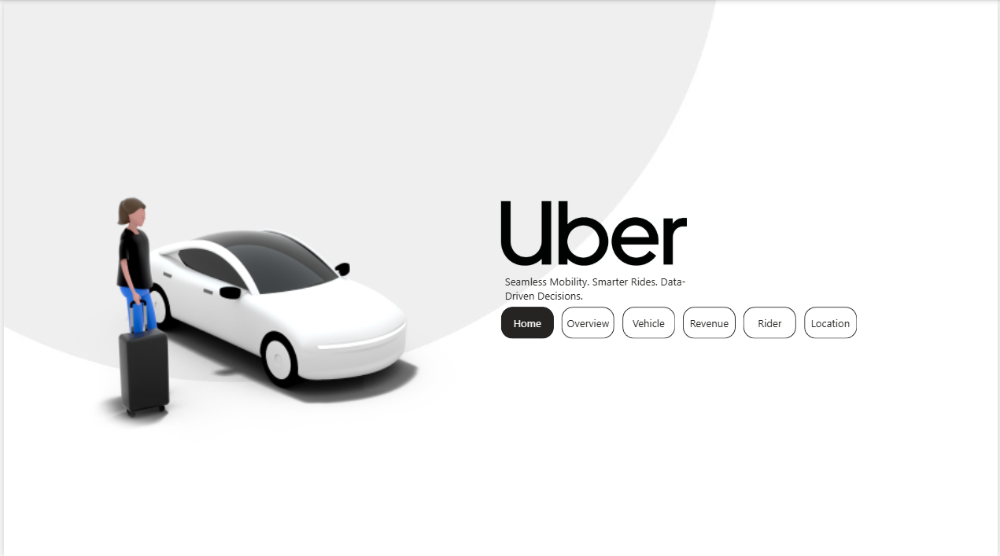
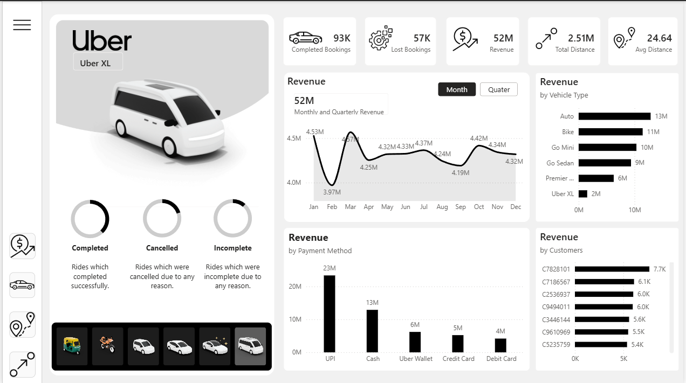

<div align="center">


[](https://powerbi.microsoft.com/)   

<a href="https://git.io/typing-svg">
  
</a>

> *"Behind every ride is a story — revenue, cancellations, distances, and decisions."*

</div>

---

## 📌 Project Overview

This project presents an interactive **Power BI dashboard** built using Uber ride booking data. It provides operational and business insights into ride performance, revenue trends, customer behavior, vehicle utilization, cancellations, and location analysis through a clean, executive-friendly interface.

---

# 🗂 Data Model

The dashboard follows a star-schema data model with a dedicated calendar table and reusable measure table for improved scalability and performance.



---

# 📂 Repository Structure

```text
Uber-Ride-Analysis-PowerBI-Dashboard/
│
├── datasets/
│   ├── uber
|
├── Dashboard/
│   └── Uber_dashboard.pbix
│
├── images/
│   ├── data_model.png
│   ├── Home.png
│   ├── Overview.png
│   ├── Revenue.png
│   └── Rider.png
│   ├── Location.png
│   ├── Vehicle.png
│
├── Uber_dashboard.pdf
└── README.md
```


# 📊 Dashboard Pages

## 🏠 Home

Landing page with navigation to all dashboard sections.



---

## 📈 Overview Dashboard

Provides an executive summary of business performance.

**Includes**

- Completed Bookings
- Lost Bookings
- Revenue
- Total Distance
- Average Distance
- Monthly Trends
- Vehicle Performance
- Time Slot Heatmap
- Pickup Location Analysis


---

## 🚗 Vehicle Analysis

Analyze performance across different vehicle categories.

**Includes**

- Revenue by Vehicle
- Completed Bookings
- Monthly Trends
- Customer & Driver Ratings
- Payment Method Analysis
- Top Pickup & Drop Locations


---

## 💰 Revenue Analysis

Comprehensive revenue analysis across multiple business dimensions.

**Includes**

- Revenue Trend
- Revenue by Vehicle Type
- Revenue by Payment Method
- Top Revenue-Generating Customers



---

## 👤 Rider Analysis

Customer segmentation and behavioral insights.

**Includes**

- First-Time Riders
- Returning Riders
- Regular Riders
- Quarterly Customer Trends
- Customer Detail Table
- Cancellation Reasons


---

## 📍 Location Analysis

Evaluate business performance across pickup locations.

**Includes**

- Revenue by Location
- Customer Count
- Booking Contribution
- Monthly Booking Trend
- Vehicle-wise Performance


---

## 📊 Key Project Insights

**Key Performance Indicators:**

| KPI                    |          Value |
| ---------------------- | -------------: |
| 🚖 Completed Bookings  |        **93K** |
| 💰 Total Revenue       |        **52M** |
| 👥 Total Customers     |       **104K** |
| 📍 Total Distance      |   **2.51M km** |
| ⭐ Avg. Customer Rating |   **4.40 / 5** |
| 🚗 Top Revenue Vehicle | **Auto (13M)** |

**Business Insights:**

* Auto generated the highest revenue, making it the best-performing vehicle category.
* UPI was the most preferred payment method, contributing the largest share of revenue.
* Customer satisfaction remained high, with an average rating of **4.40**.
* Ride demand peaked during the evening hours (**6 PM – 9 PM**), indicating the busiest operating period.
* Khandsa recorded the highest number of pickup bookings, highlighting it as a key demand location.

---

## 🛠️ Tools & Skills Used

| Tool | Purpose |
|------|---------|
| **Power BI Desktop** | Dashboard design, data modeling, report creation |
| **DAX** | Custom measures (Total Revenue, Cancellation %, Avg Distance) |
| **Decomposition Tree Visual** | AI-driven root cause analysis of revenue |
| **Slicers & Filters** | Interactive vehicle type, location, month filters |
| **Custom Navigation** | Button-based page navigation (HOME → OVERVIEW → etc.) |
| **Color Theming** | Minimalist Uber-inspired black & white brand palette |

---

## 💡 What This Project Demonstrates

- ✅ **Multi-page dashboard design** with consistent UI/UX principles
- ✅ **AI visual usage** — Decomposition Tree for advanced root cause analysis
- ✅ **DAX proficiency** — Custom measures for tracking business KPIs
- ✅ **Cancellation analysis** — Identifying and isolating operational pain points
- ✅ **Stakeholder-ready storytelling** — Transforming raw tabular data into actionable insights

---

## 👨‍💻 About Me

<div align="center">

[](https://github.com/jerin060)
[](https://linkedin.com/in/jarin-akther-analyst)

*Building AI systems and dashboards that make data analysis accessible, automated, and actionable* 🤖

</div>

---

<div align="center">


</div>
